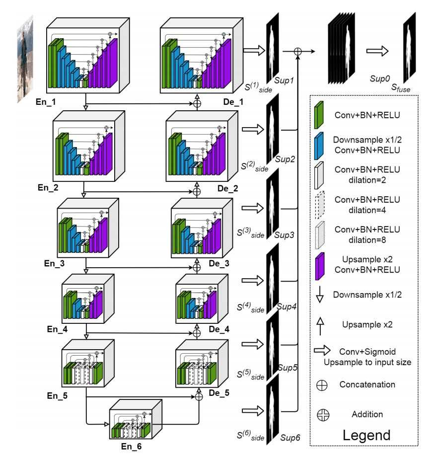
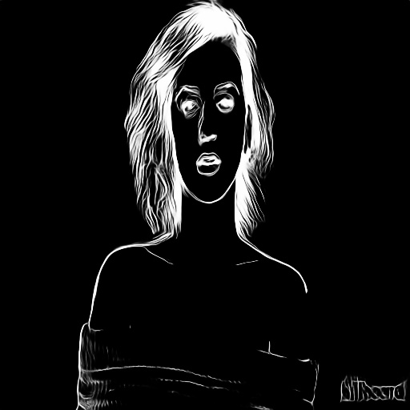

# Gan2onnx
We are converting GAN model for background removal U2-Net to onnx format for faster inference on any device, mainly low computation devices.

# Paper 
https://arxiv.org/abs/2005.09007

# Architecture 

# Steps to run :
* create directories and download pretrained u2net portrait model
  * mkdir saved_models
  * mkdir saved_models/u2net_portrait/
  * pip install gdown 
  * gdown --id 1IG3HdpcRiDoWNookbncQjeaPN28t90yW --output saved_models/u2net_portrait/u2net_portrait.pth 
* python torch_2_onnx.py It will convert our torch model to onnx format 
* python onnx_inference.py u2net portrait model inference on converted onnx format 

# Result - ONNX inference 

